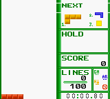

# Game Boy Tetris RL

[](https://github.com/SnaetWarre/game-boy-tetris-rl/actions/workflows/ci.yml)

A small reinforcement-learning project that trains one hold-aware spatial policy
to play [Pandora's Blocks](https://github.com/Villadelfia/dmgtris), an
open-source Game Boy falling-block game, through
[PyBoy](https://github.com/Baekalfen/PyBoy).



This preview is a real 10-line PyBoy hybrid run with an explicit planner
override: 27 pieces, 10 hold actions, and 12 reported planner disagreements.

The policy does not scrape pixels. It receives a 202-value observation:

- 180 settled board cells
- 7 values for the current piece
- 7 values for the next piece
- 8 values for the hold slot, including empty

It chooses one of 80 actions: four rotations by ten columns, either directly or
after using hold.

These are atomic placement-control actions, not human-speed button sequences.
The adapter returns the active piece to its legal spawn row and pauses gravity
only while applying the requested rotation and horizontal movement. It restores
the ROM's current gravity before the hard drop. This keeps the Gymnasium action
contract exact as Pandora's Blocks accelerates, but placement-control results
are not human-equivalent records.

## Run the demo

Install the locked environment and fetch the checksum-pinned GPL ROM:

```sh
uv sync --locked
uv run gb-tetris-rl bootstrap
uv run gb-tetris-rl doctor
```

Then run the canonical local checkpoint:

```sh
uv run gb-tetris-rl demo
```

The demo opens PyBoy, aims for 40 lines, and explicitly replaces every neural
action that differs from the deterministic planner. It prints disagreement and
rescue counts so a stable hybrid run cannot be mistaken for pure neural
performance.

Add `--fast` to keep the emulator window visible but remove its frame limiter:

```sh
uv run gb-tetris-rl demo --fast
```

To see what the neural policy can do by itself:

```sh
uv run gb-tetris-rl demo --neural-only
```

`models/demo-agent.zip` is a generated local artifact and is intentionally not
committed. Train a replacement if it is missing.

## Where the agent learns

The v0.3 policy has four parts:

- a convolutional encoder that preserves the 18 by 10 board geometry
- a separate encoder for current, next, and held-piece context
- dueling value and action-advantage heads
- canonical action masks that remove duplicate rotations and columns where a
  piece cannot fit

The accepted training path is planner imitation:

```text
deterministic planner
        |
        | labels simulated board states
        v
imitation pretraining                 src/gb_tetris_rl/agent/imitation.py
        |
        | trains the spatial dueling policy
        v
  imitation.zip                       accepted checkpoint
```

1. `generate_planner_demonstrations` simulates legal placements and records the
   planner's chosen action for each board.
2. `pretrain_policy_from_demonstrations` updates the policy network with
   cross-entropy loss so it learns to copy those choices.
3. Noncanonical action aliases are masked during both imitation and inference,
   so the network spends capacity on distinct placements.

Emulator DQN fine-tuning remains available through `--timesteps`, but it is off
by default. In the v0.3 acceptance run, 50,000 extra DQN steps reduced the
20-seed mean from 7.60 to 2.90 lines, so that checkpoint was rejected rather
than promoted.

The planner in `agent/planner.py` never learns. It is a deterministic baseline,
a source of imitation labels, and an optional demo guard or override.

## Train

```sh
uv run gb-tetris-rl train \
  --run-dir models/runs/spatial-imitation-v030 \
  --demonstrations 50000 \
  --imitation-epochs 80 \
  --device cuda \
  --envs 4
```

Every run has an explicit artifact layout:

```text
models/runs/spatial-imitation-v030/
  imitation.zip       policy after planner imitation
  dqn-final.zip       only created when --timesteps is greater than zero
  dqn-checkpoints/    optional reinforcement-learning recovery checkpoints
```

The project root keeps only `models/demo-agent.zip` as the canonical local demo
checkpoint. Historical local experiments live in `models/archive/` and are not
part of the runtime path.

## Verified result

### Long-running placement control

The former controller started missing requested columns as gravity increased.
On seeds 10000 through 10004 it topped out at 239, 253, 255, 257, and 240
cleared lines. After making placement actions atomic, all five seeds reached the
500-line evaluation cap with zero final holes. Seed 10000 also reached 1,000
lines with zero holes in 3,014 pieces.

```sh
uv run gb-tetris-rl planner \
  --target-lines 1000 \
  --maximum-pieces 10000 \
  --seed 10000
```

Those are deterministic planner results used to validate the emulator action
contract. They are a stronger source of imitation labels, not neural-only
performance. The raw comparison is committed in
`docs/benchmarks/placement-control-v0.4.0.json`.

### Neural-only policy

Neural-only evaluation on the same 50 deterministic seeds, 10000 through 10049:

| Checkpoint | Mean lines | Median | Minimum | Maximum |
| --- | ---: | ---: | ---: | ---: |
| Previous local agent | 2.18 | 2 | 1 | 5 |
| v0.3 spatial imitation | 6.70 | 6 | 1 | 17 |

That is a 3.07 times increase in mean cleared lines for this fixed-seed test.
The raw per-episode line counts and model checksums are committed in
`docs/benchmarks/v0.3.0.json`. This establishes the strongest neural checkpoint
tested in this repository, not a general Tetris record.

Evaluate checkpoints on fixed seeds before promoting one to the demo:

```sh
# Honest neural-only result
uv run gb-tetris-rl evaluate \
  --model models/runs/spatial-imitation-v030/imitation.zip \
  --episodes 50 \
  --seed 10000 \
  --report models/runs/spatial-imitation-v030/neural-50-eval.json

# Hybrid result, reported separately
uv run gb-tetris-rl evaluate \
  --model models/runs/spatial-imitation-v030/imitation.zip \
  --episodes 5 \
  --planner-safety \
  --target-lines 40
```

`--planner-safety` only replaces structurally invalid actions or a placement
that makes the known next piece impossible. Use `--planner-override` when every
planner disagreement should be replaced. Reports identify the mode and keep
disagreements separate from actual safety rescues.

Line counts on deterministic, unseen seeds are the acceptance metric. Training
reward alone is not enough evidence that the policy learned useful play.

## Project map

```text
src/gb_tetris_rl/
  agent/
    planner.py       pure board simulator and deterministic action planner
    imitation.py     demonstration generation and imitation optimization
    action_masks.py  unique rotations and width-aware valid action masks
    smart_dqn.py     spatial encoder and dueling policy network
    training.py      policy construction, training stages, checkpoints
    evaluation.py    neural-only and planner-guarded evaluation, GIF output
  game/
    contracts.py     the single 202-input/80-action agent contract
    environment.py   Gymnasium environment and reward transitions
    pandoras_blocks.py  source-backed memory reader and emulator controls
    rewards.py       pure board measurements and reward shaping
    rom.py           cartridge title and checksum validation
  commands.py        command workflows
  cli.py             argument parsing only
  homebrew.py        pinned ROM and symbol download
tests/                mirrors the modules above
models/               generated artifacts, documented separately
```

The runtime loop is deliberately short:

```text
Pandora's Blocks ROM
        v
PandorasBlocksAdapter -> TetrisEnvironment -> 202-value observation
        ^                                         |
        |                                         v
        +---------- one of 80 actions <- DQN policy
```

## Other useful commands

Run the deterministic planner without loading a neural model:

```sh
uv run gb-tetris-rl planner --target-lines 40 --window
```

Record an evaluated policy as a GIF:

```sh
uv run gb-tetris-rl evaluate \
  --model models/demo-agent.zip \
  --episodes 1 \
  --record recordings/demo.gif
```

## Legal boundary

`bootstrap` downloads a source-matched Pandora's Blocks ROM and symbol file from
the upstream GPL-3.0 project and verifies both checksums. ROMs, symbols, emulator
state, recordings, and model weights stay ignored by Git.

This project no longer carries a second Nintendo Tetris integration. Keeping one
legally reproducible game and one agent contract makes the training and demo path
easy to audit.
